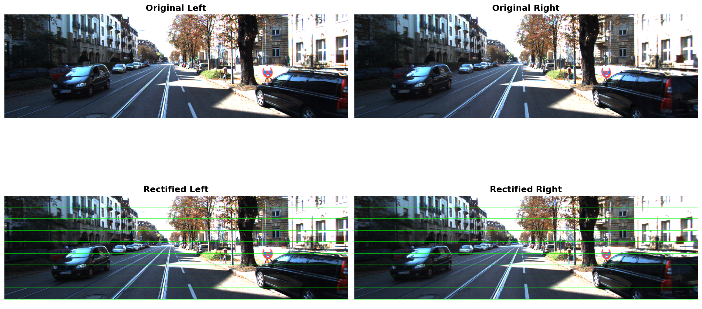
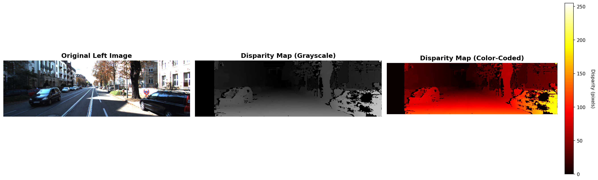
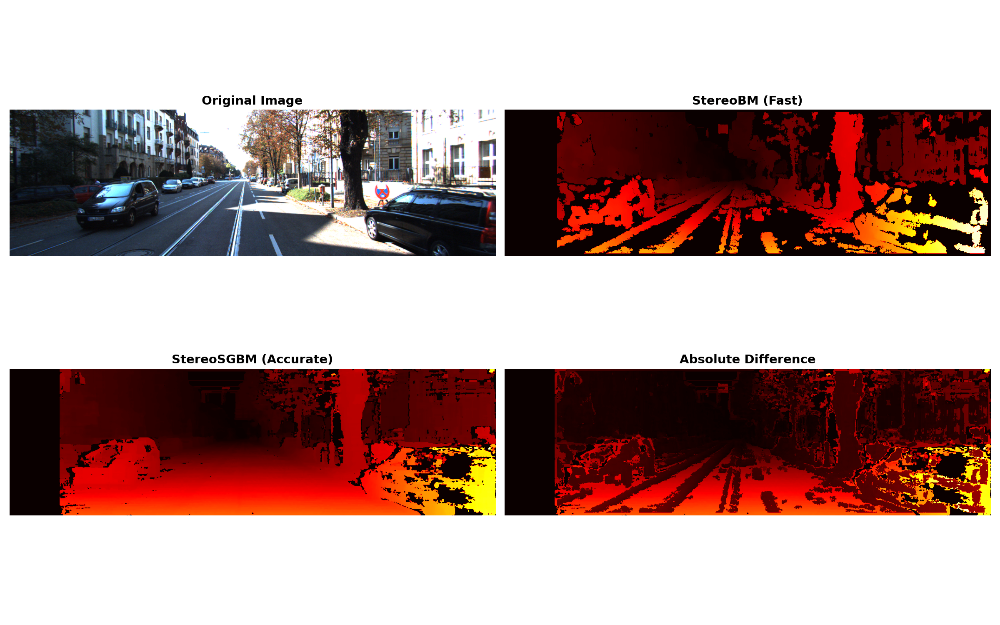
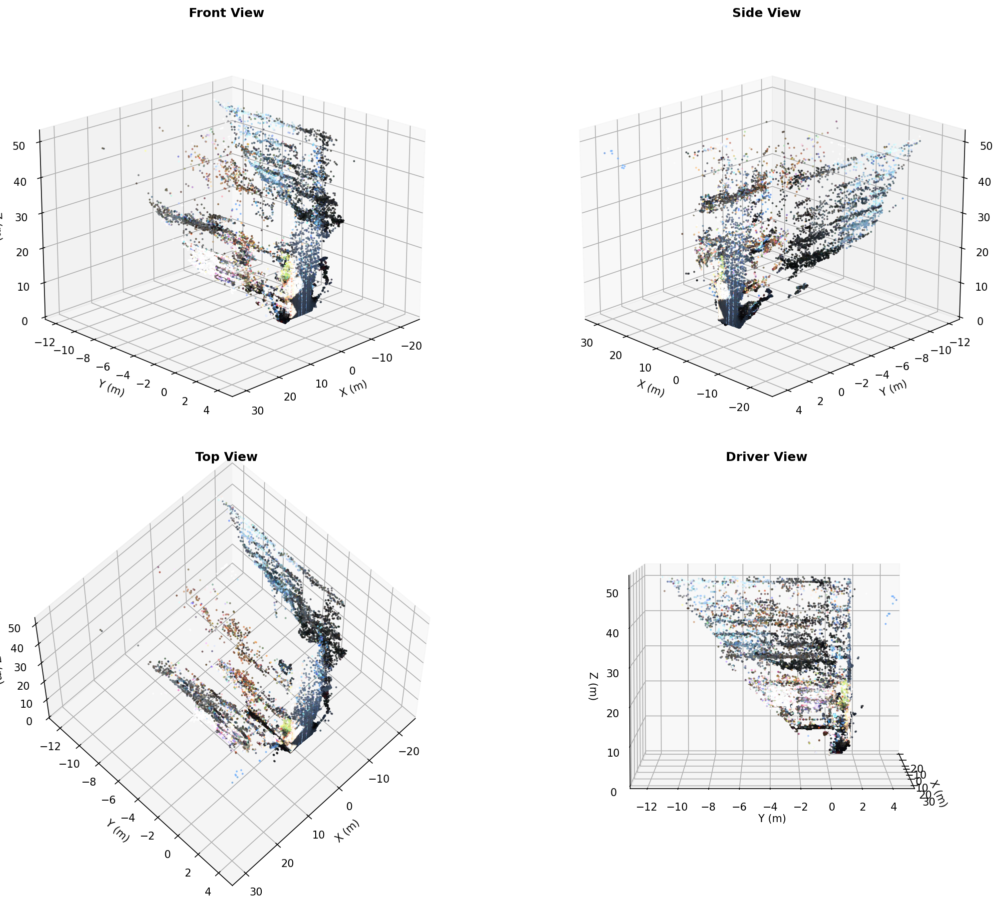

# Stereo Vision Pipeline on KITTI Dataset

Complete implementation of a stereo vision pipeline for 3D reconstruction from stereo images.

## Overview

This project implements a full stereo vision pipeline using the KITTI Vision Benchmark dataset, including camera calibration parsing, stereo rectification, disparity map computation, and 3D point cloud reconstruction.

## Features

- **Calibration Parser**: Extract camera parameters from KITTI calibration files
- **Stereo Rectification**: Align stereo image pairs for simplified matching
- **Disparity Computation**: Calculate depth maps using stereo matching algorithms
- **3D Reconstruction**: Generate point clouds from disparity maps (WIP)

## Tech Stack

- Python 3.9+
- OpenCV 4.8+
- NumPy
- Matplotlib

## Project Structure
```
stereo-vision-kitti/
├── src/
│   ├── calibration.py      # Camera calibration parser
│   ├── rectification.py    # Stereo rectification
│   ├── disparity.py        # Disparity computation
│   └── reconstruction.py   # 3D reconstruction (WIP)
├── results/
│   ├── rectified/          # Rectified stereo pairs
│   └── disparity/          # Disparity maps
├── requirements.txt
└── README.md
```

## Installation
```bash
# Clone repository
git clone https://github.com/ZERMANESARA/stereo-vision-kitti.git
cd stereo-vision-kitti

# Create virtual environment
conda create -n stereo-vision python=3.9
conda activate stereo-vision

# Install dependencies
pip install -r requirements.txt
```

## Dataset

This project uses the [KITTI Vision Benchmark Suite](http://www.cvlibs.net/datasets/kitti/).

**Note:** Dataset not included in repository due to size. Download separately:
- `data_scene_flow.zip` (~2GB)
- `data_scene_flow_calib.zip` (~14MB)

Extract to `data/` folder.

## Usage

### 1. Calibration Parsing
```bash
python src/calibration.py
```

Extracts camera parameters from KITTI calibration files.

**Output parameters:**
- Focal length: 721.54 px
- Baseline: 47.06 cm
- Principal point: (609.56, 172.85)

### 2. Stereo Rectification
```bash
python src/rectification.py
```

Rectifies stereo image pairs to align epipolar lines horizontally.

**Result:**



*Before (top): Original stereo pair | After (bottom): Rectified with horizontal epipolar lines*

### 3. Disparity Computation
```bash
python src/disparity.py
```

Computes disparity maps using Semi-Global Block Matching (SGBM) algorithm.

**Result:**



*Left: Original image | Center: Grayscale disparity | Right: Color-coded disparity*

**Interpretation:**
- Warm colors (yellow/orange): Close objects (1-5m)
- Cool colors (red): Medium distance (5-20m)
- Dark/black: Far objects (>20m) or no correspondence

**Disparity to depth conversion:**
```
depth (meters) = (focal_length × baseline) / disparity
depth = (721.54 px × 0.4706 m) / disparity
```

### Algorithm Comparison

We tested both StereoBM and StereoSGBM algorithms:



**StereoBM (Fast):**
- Very fast computation (~2-3 seconds)
- Many artifacts in textureless regions
- Best for: Quick previews, real-time applications

**StereoSGBM (Accurate):**
- High-quality disparity maps
- Better handling of textureless regions
- Smooth depth transitions
- Best for: Production quality, offline processing

**Conclusion:** We use StereoSGBM for final results due to superior quality.

## Results

### Calibration
Successfully parses KITTI calibration files and extracts projection matrices, intrinsic parameters, focal length, and baseline.

### Rectification
Aligns stereo images so that corresponding points lie on the same horizontal line, simplifying stereo matching from a 2D to a 1D search problem.

### Disparity Computation
Generates depth maps with disparity range typically 1-255 pixels, corresponding to depth range of approximately 1-340 meters for KITTI dataset.

### 4. 3D Reconstruction
```bash
python src/reconstruction_3d.py
```

Reconstructs 3D point cloud from disparity map using triangulation.

**Result:**



*Four viewing angles: Front, Side, Top, and Driver perspectives*

**Technical details:**
- Triangulation formula: X = (x - cx) × Z / f, Y = (y - cy) × Z / f, Z = (f × B) / d
- Output: PLY format point cloud (compatible with MeshLab, CloudCompare, Blender)
- Each point contains 3D position (X, Y, Z) and RGB color from original image

**Scene dimensions (Scene 000000):**
- Width: 30 meters
- Height: 50 meters
- Depth: 50 meters
- Points: ~63,000 after filtering

**Identified objects:**
- Cars: 5-15m distance
- Trees: Side boundaries, 10-15m height
- Buildings: 20-40m distance, 15-30m height
- Road surface: 0-40m extent

**Export formats:**
- PLY: Standard 3D point cloud format
- PNG: Static visualizations
- Interactive: Matplotlib 3D viewer (rotatable)

## Roadmap

- [x] Calibration parsing
- [x] Stereo rectification
- [x] Disparity map computation
- [x] Multiple viewing angles
- [x] PLY export for external viewers

## Complete Pipeline Summary

This project demonstrates a full stereo vision pipeline from raw stereo images to 3D point clouds:

**Input:** Stereo image pair (left + right cameras)
**Output:** 3D colored point cloud

**Pipeline stages:**
1. **Calibration** - Extract camera parameters (focal length, baseline)
2. **Rectification** - Align epipolar lines horizontally
3. **Stereo Matching** - Compute disparity map (StereoSGBM)
4. **3D Reconstruction** - Triangulate 3D points from disparity

**Applications:**
- Autonomous vehicles (depth perception)
- Robotics (navigation and obstacle avoidance)
- Industrial automation (3D measurements)
- AR/VR (scene reconstruction)
- Medical imaging (stereo endoscopy)

## Performance

**Processing time (Scene 000000 on standard laptop):**
- Calibration: <1 second
- Rectification: ~3 seconds
- Disparity computation: ~15 seconds
- 3D reconstruction: ~30 seconds
- **Total pipeline: ~50 seconds**

**Accuracy:**
- Depth range: 1-50 meters
- Depth resolution: ~0.1 meters at 10m distance
- Point cloud density: ~60,000 points per scene

## Author

**Sara Zermane**

Computer Vision Engineer | Multi-Camera Systems Specialist

[LinkedIn](https://www.linkedin.com/in/sara-zermane) | [GitHub](https://github.com/ZERMANESARA)

## License

This project is available for portfolio and educational purposes.

---

*Project developed as part of computer vision portfolio - November 2025*